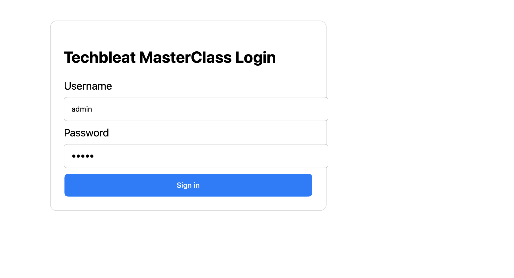
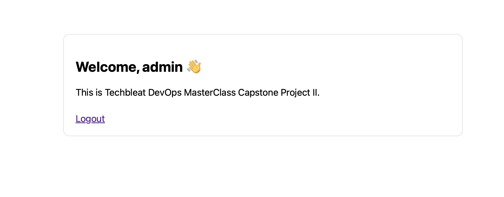

# Techbleat DevOps MasterClass – FastAPI Demo Application

 # Project Architecture
 The project follows a classic three-tier architecture deployed within a Virtual Private Cloud (VPC) on AWS, ensuring a clear separation of concerns and high security.
 # Core Components
 ## Bastion Host (Public Subnet): Acts as the secure gateway (Jump Server) for the entire infrastructure. It hosts the Nginx Reverse Proxy, Prometheus, and Grafana.
 ## Backend Application (Private Subnet): A FastAPI application running on a private instance. It is shielded from direct internet access.
 ## Database Tier (RDS): A managed PostgreSQL instance (Amazon RDS) that stores application data.
 ## Security Layers: Multi-level security using AWS Security Groups and host-based firewalls (Firewalld).

 # 🛡️ Security Hardening
 ## Security is baked into every layer of the deployment using an os_hardening Ansible role.
 ## SSH Hardening: Password authentication is disabled in favor of SSH key-based access.
 ## Firewall Management: firewalld is enabled on all instances, allowing only necessary traffic (Port 22, 80, 3000, 8000, 9090, 9100).
 ## SELinux: Configured to allow Nginx to connect to the network for reverse proxying.
 ## Vulnerability Scanning: * Bandit: Scans the Python codebase for security flaws.
 ### Safety/pip-audit: Scans requirements.txt for known vulnerabilities in dependencies.
 # 📊 Monitoring & Observability
 ## A full observability stack is deployed on the Bastion host to monitor the health of the Backend.
 ## Prometheus: Scrapes hardware metrics from the Backend and health status from the App.
 ## Node Exporter: Installed on the Backend to provide real-time CPU, RAM, and Disk metrics.
 ## Grafana: Provides a visual dashboard. A pre-configured "Node Exporter Full" dashboard is provisioned automatically.
 ## Alertmanager: (Optional Extension) Configured to send email alerts via SMTP if the Backend instance goes down.
 # 🚀 Deployment Workflow
## The deployment is automated via a GitHub Actions CI/CD pipeline using Ansible.
 ## 1. Infrastructure Provisioning
 ## -Inventory is dynamically generated or manually defined (e.g., inventory.ini).
 ## -Ansible connects to the Bastion and Backend to apply configuration.
 ## 2. Application Deployment
 ## -The FastAPI application is transferred to the Backend.
 ## -Dependencies are installed "offline" from a wheels directory to ensure consistency.
 ## -The app is started in the background using Uvicorn.
 # 3. Reverse Proxy Setup
 ## -Nginx is installed on the Bastion.
 ## -A custom proxy configuration routes traffic from http://<Bastion_IP>/ to http://<Backend_IP>:8000.
 # 🌐 Accessing the Project
 ## -Once the pipeline finishes, the services are available at the Bastion's Public IP:
 ## Service                                   URL
 ## Main Application                          http://'public IP'/     
 ## App Health Check                          http://'public IP'/healthz
 ## Grafana Dashboard                         http://'public IP':3000 (admin/admin)
 ## Prometheus UI                             http://'public IP':9090

 # Project Structure
.
├── .github/
│   └── workflows/
│       └── main.yml            # The CI/CD Pipeline (Terraform + Ansible)
├── ansible/
│   ├── master.yml              # Main Playbook (Orchestrates all roles)
│   ├── inventory.ini           # Generated dynamically by GitHub Actions
│   └── roles/
│       ├── os_hardening/       # Security & Firewall configuration
│       ├── db_servers/         # RDS Connectivity & DB setup
│       ├── app_servers/        # FastAPI deployment & service setup
│       ├── node_exporter/      # Metric collector (installed on Backend)
│       ├── monitoring_server/  # Prometheus & Grafana (installed on Bastion)
│       ├── nginx_proxy/        # Reverse Proxy (installed on Bastion)
│       └── vulnerability_scanning/
├── app/
│   ├── main.py                 # FastAPI Application Code
│   ├── requirements.txt        # Python Dependencies
│   └── database.py             # SQLAlchemy Connection Logic
├── terraform/
│   ├── main.tf                 # VPC, Subnets, and EC2 instances
│   ├── rds.tf                  # Database instance & Subnet groups
│   ├── security_groups.tf      # Firewall rules (Port 80, 3000, 8000, etc.)
│   ├── outputs.tf              # IPs passed to GitHub Env
│   └── variables.tf            # Configuration variables
└── README.md                   # Project Documentation