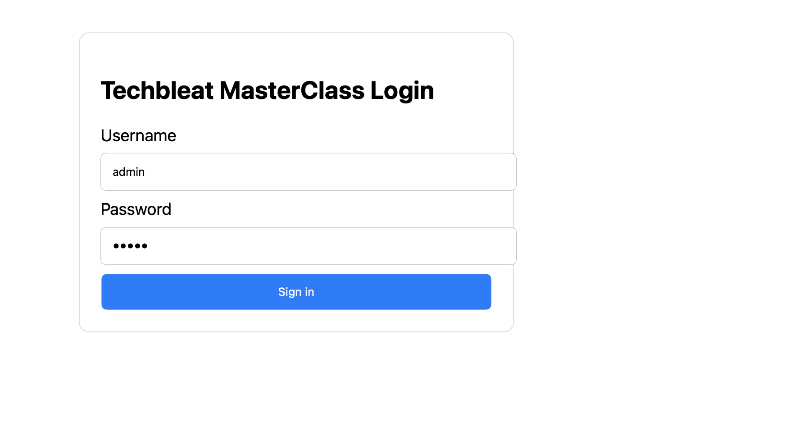
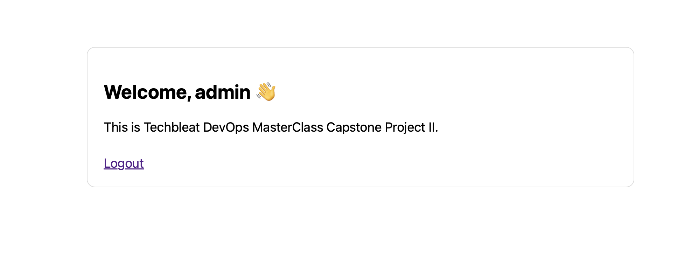

# Techbleat DevOps MasterClass – FastAPI Demo Application

 # Project Architecture
 The project follows a classic three-tier architecture deployed within a Virtual Private Cloud (VPC) on AWS, ensuring a clear separation of concerns and high security.
 # Core Components
 ## Bastion Host (Public Subnet): Acts as the secure gateway (Jump Server) for the entire infrastructure. It hosts the Nginx Reverse Proxy, Prometheus, and Grafana.
 ## Backend Application (Private Subnet): A FastAPI application running on a private instance. It is shielded from direct internet access.
 ## Database Tier (RDS): A managed PostgreSQL instance (Amazon RDS) that stores application data.
 ## Security Layers: Multi-level security using AWS Security Groups and host-based firewalls (Firewalld).

 # 🛡️ Security Hardening
 ## Security is baked into every layer of the deployment using an os_hardening Ansible role.
 ## SSH Hardening: Password authentication is disabled in favor of SSH key-based access.
 ## Firewall Management: firewalld is enabled on all instances, allowing only necessary traffic (Port 22, 80, 3000, 8000, 9090, 9100).
 ## SELinux: Configured to allow Nginx to connect to the network for reverse proxying.
 ## Vulnerability Scanning: * Bandit: Scans the Python codebase for security flaws.
 ### Safety/pip-audit: Scans requirements.txt for known vulnerabilities in dependencies.
 # 📊 Monitoring & Observability
 ## A full observability stack is deployed on the Bastion host to monitor the health of the Backend.
 ## Prometheus: Scrapes hardware metrics from the Backend and health status from the App.
 ## Node Exporter: Installed on the Backend to provide real-time CPU, RAM, and Disk metrics.
 ## Grafana: Provides a visual dashboard. A pre-configured "Node Exporter Full" dashboard is provisioned automatically.
 ## Alertmanager: (Optional Extension) Configured to send email alerts via SMTP if the Backend instance goes down.
 # 🚀 Deployment Workflow
## The deployment is automated via a GitHub Actions CI/CD pipeline using Ansible.
 ## 1. Infrastructure Provisioning
 ## -Inventory is dynamically generated or manually defined (e.g., inventory.ini).
 ## -Ansible connects to the Bastion and Backend to apply configuration.
 ## 2. Application Deployment
 ## -The FastAPI application is transferred to the Backend.
 ## -Dependencies are installed "offline" from a wheels directory to ensure consistency.
 ## -The app is started in the background using Uvicorn.
 # 3. Reverse Proxy Setup
 ## -Nginx is installed on the Bastion.
 ## -A custom proxy configuration routes traffic from http://<Bastion_IP>/ to http://<Backend_IP>:8000.
 # 🌐 Accessing the Project
 ## -Once the pipeline finishes, the services are available at the Bastion's Public IP:
 ## Service                                   URL
 ## Main Application                          http://'public IP'/     
 ## App Health Check                          http://'public IP'/healthz
 ## Grafana Dashboard                         http://'public IP':3000 (admin/admin)
 ## Prometheus UI                             http://'public IP':9090

# 🛠️ Tech Stack
## Cloud: AWS (EC2, RDS, VPC)

## Configuration: Ansible

## Web Server: Nginx

## App Framework: FastAPI (Python 3.9)

## Database: PostgreSQL

## Monitoring: Prometheus, Grafana, Node Exporter

## CI/CD: GitHub Actions

                +-----------------------------+
                |       GitHub Actions        |
                |  (CI runner in the cloud)   |
                +-----------------------------+
                         |
                         | 1) Checkout code, run Bandit (local)
                         | 2) Terraform: create Bastion + Backend, RDS, etc.
                         | 3) Download:
                         |      - Python wheels → ./dependencies
                         |      - Node Exporter → ./downloads
                         |
                         | 4) Run Ansible master.yml
                         v
     ===================================================================
                         Ansible Playbook: master.yml
     ===================================================================
                         |
                         |  (uses SSH + key.pem to reach Bastion,
                         |   Bastion then reaches Backend)
                         v
+-------------------------------------------------------------+
|                         BASTION (web)                      |
|            Public subnet, has internet access              |
+-------------------------------------------------------------+
| Roles from master.yml that run here:                       |
|                                                             |
| 1) os_hardening                                             |
|    - Secure OS, firewall, SSH                              |
|                                                             |
| 2) monitoring_server                                        |
|    - Install Prometheus, Grafana, Alertmanager             |
|    - Prometheus scrapes backend:                           |
|        - {{ backend_ip }}:9100 (Node Exporter)             |
|        - {{ backend_ip }}:8000 (FastAPI health)            |
|                                                             |
| 3) nginx_proxy                                              |
|    - Install Nginx                                         |
|    - Proxy public HTTP → http://{{ backend_ip }}:8000      |
|                                                             |
| 4) vulnerability_scanning (delegated tasks)                |
|    - Copy key.pem here                                     |
|    - Install Bandit, Safety                                |
|    - SSH/rsync to backend to pull app code + requirements  |
|    - Run scans and send results back to backend report     |
+-------------------------------------------------------------+
                         ^
                         |  SSH (jump host)
                         |
+-------------------------------------------------------------+
|                         BACKEND (backend)                  |
|           Private subnet, NO direct internet               |
+-------------------------------------------------------------+
| Roles from master.yml that run here:                       |
|                                                             |
| 1) os_hardening                                             |
|    - Secure OS, firewall, SSH                              |
|    - Open app port 8000                                    |
|                                                             |
| 2) db_servers                                               |
|    - Configure DB tier (RDS connection, users, etc.)       |
|                                                             |
| 3) app_servers                                              |
|    - Copy from GitHub runner → backend:                    |
|        - app/                                              |
|        - requirements.txt                                  |
|        - dependencies/  (Python wheels)                    |
|    - Offline pip install using local dependencies/         |
|    - Start FastAPI (uvicorn) on port 8000                  |
|    - Health check /healthz                                 |
|                                                             |
| 4) node_exporter                                            |
|    - Copy Node Exporter tarball from runner → backend      |
|    - Install and run node_exporter on port 9100            |
|                                                             |
| 5) vulnerability_scanning                                   |
|    - Receive unified report /tmp/scan_report.txt           |
|      (written using results gathered from Bastion)         |
+-------------------------------------------------------------+

                ↑                                          ↑
                |                                          |
          External user                             Prometheus on Bastion
          (browser)                                  scrapes Backend
   http://BASTION_PUBLIC_IP/                    (9100 & 8000 via private IP)
        │
        └─> Nginx on Bastion → http://BACKEND_IP:8000
